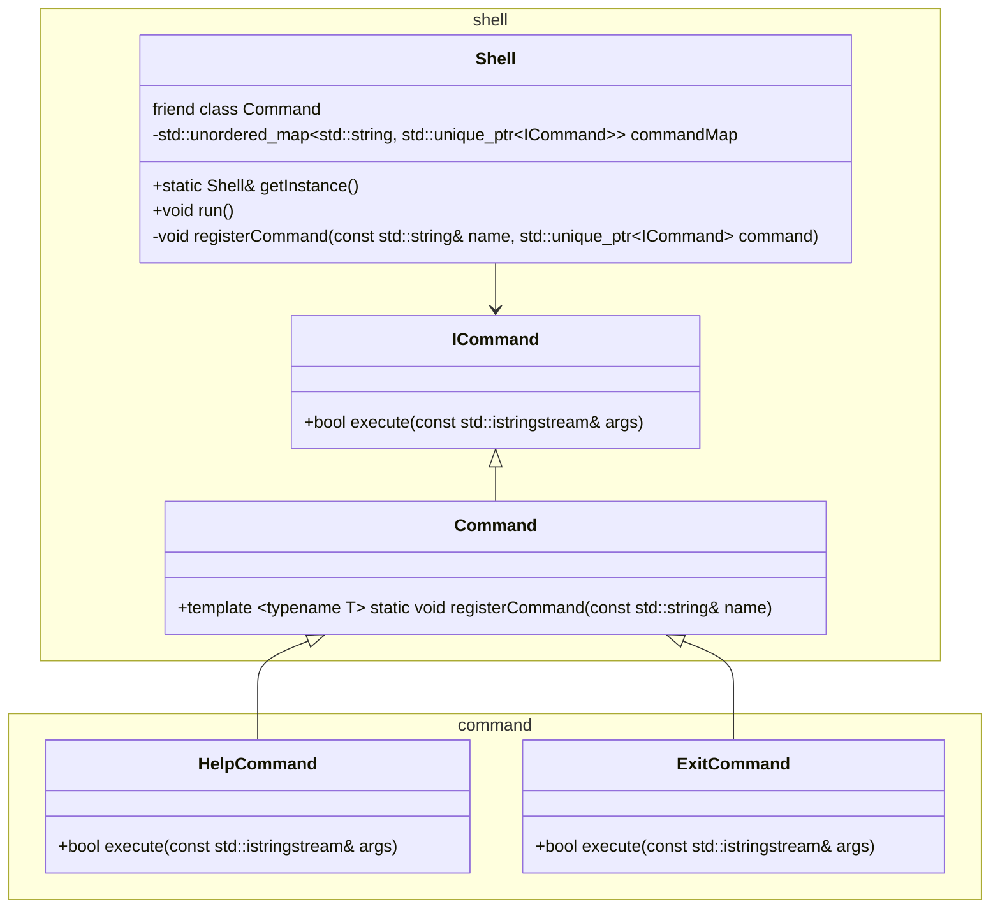

# Simple Shell

This project is a simple shell implementation in C++. It allows users to execute commands, handle input/output redirection, and manage background processes.

## Class Diagram


## Usage

1. Clone the repository:
    ```sh
    git clone <repository-url>
    cd simple-shell
    ```

2. Compile the source code:
    ```sh
    make
    ```

3. Run the shell:
    ```sh
    ./simple-shell
    ```

## License

This project is licensed under the MIT License.
